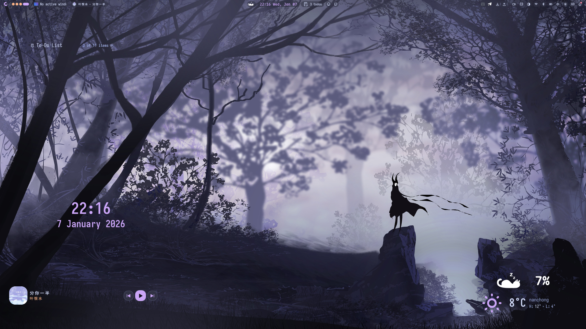
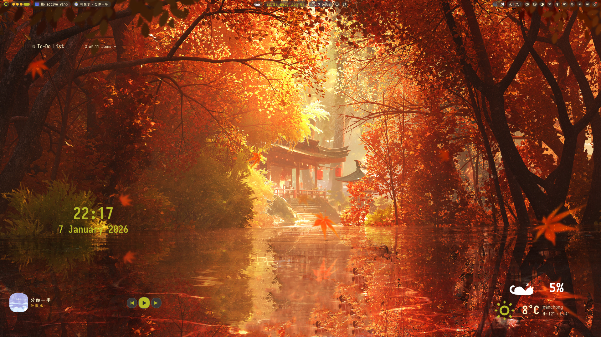
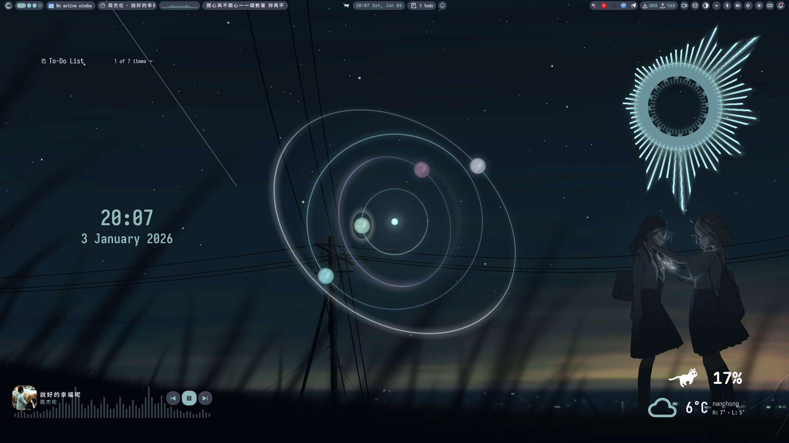

<h1 align="center">
   
    
   Lonero's NixOS Configuration
    
      
    
</h1>

    My personal NixOS configuration, managed with Nix Flakes.

    
    
    
    

## 🖼️ Previews

### 🌟 Catppuccin Style

|  |
| :-----------------------------------------: |

  
🎨 Gruvbox Style (Click to expand)

|  |
| :--------------------------------------: |

  
🎨 Nord Style (Click to expand)

|  |
| :-----------------------------------: |

---

> [!IMPORTANT]
> Note: Although this configuration includes home-manager integration, I do not use it for managing user configurations.

> [!CAUTION]
> This configuration contains encrypted secrets managed by sops-nix that require my personal keys. Do not attempt to directly install this configuration.

---

## ✨ Features

- **Declarative & Reproducible**: Managed entirely by Nix Flakes
- **Desktop Environment**: Hyprland/Niri with Stylix theming
- **Security**: Encrypted secrets with sops-nix
- **Development**: Neovim with nvf configuration

---

## 📂 Structure

This repository is organized as follows:

- `flake.nix`: The entry point for the entire configuration, defining all inputs and outputs.
- `hosts/`: Contains system-level configurations for specific machines.
  - `loneros/`: Main desktop system with NVIDIA GPU support, Hyprland/Niri window managers, and comprehensive application suite.
  - `loneros-wsl/`: WSL-specific configuration for Windows Subsystem for Linux with optimized packages for development.
  - `bootstrap/`: Minimal installation environment with impermanence support, used for system installation and recovery.
  - `remote-vm/`: Remote virtual machine configuration with secure boot support.
- `home/`: Manages user-level application configurations and dotfiles.
- `system/`: Holds global, cross-host system modules.
- `programs/`: Declaratively manages configurations for various applications.
- `servers/`: Contains configurations for system background services.
- `modules/`: Reusable custom NixOS modules for different configurations.
- `overlays/`: Modifications or overrides for existing packages in `nixpkgs`.
- `pkgs/`: Contains custom-defined packages.
- `themes/`: Manages themes and visual styles for the system and applications.
- `devShell/`: Provides development environments for different programming languages.
- `iso/`: Configuration for building a bootable NixOS ISO image.
- `deploy/`: Contains configurations related to remote deployment.
- `cluster/`: Kubernetes cluster configurations (k3s, kubeconfig).
- `lib/`: Contains custom Nix helper functions.
- `secrets/`: Manages encrypted files using `sops-nix`.

---

## ☁️ Cache

- substituter: `https://loneros.cachix.org`
- public-key: `loneros.cachix.org-1:dVCECfW25sOY3PBHGBUwmQYrhRRK2+p37fVtycnedDU=`
