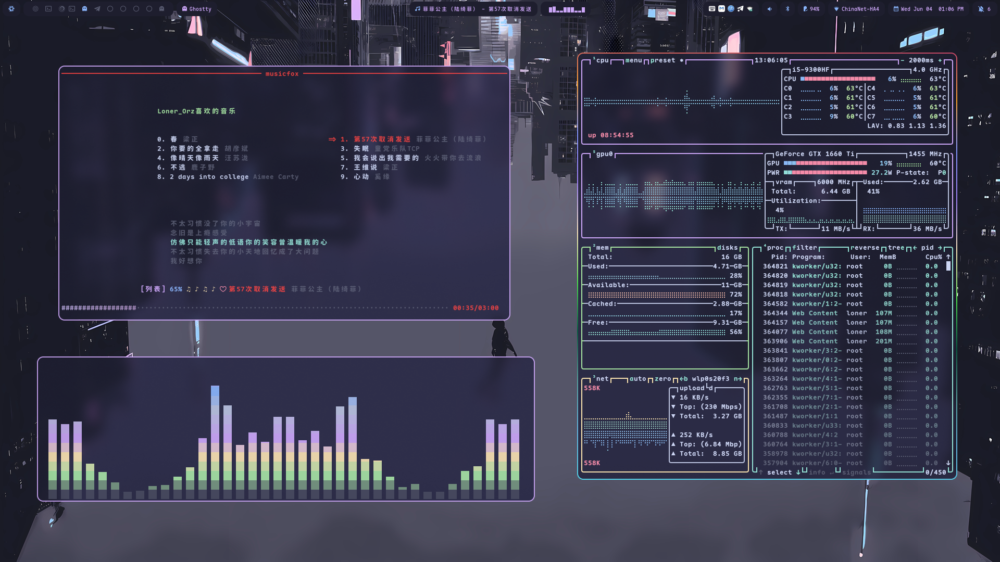
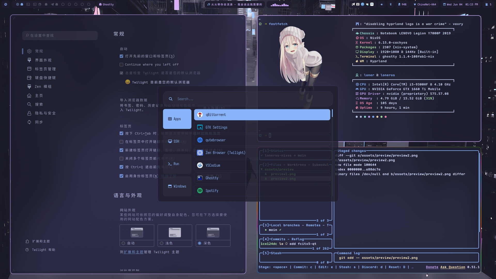
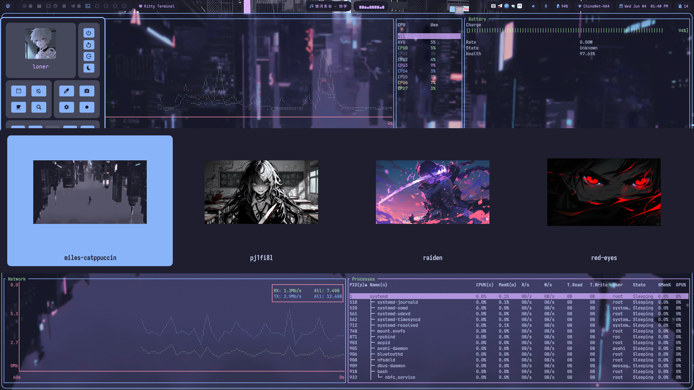
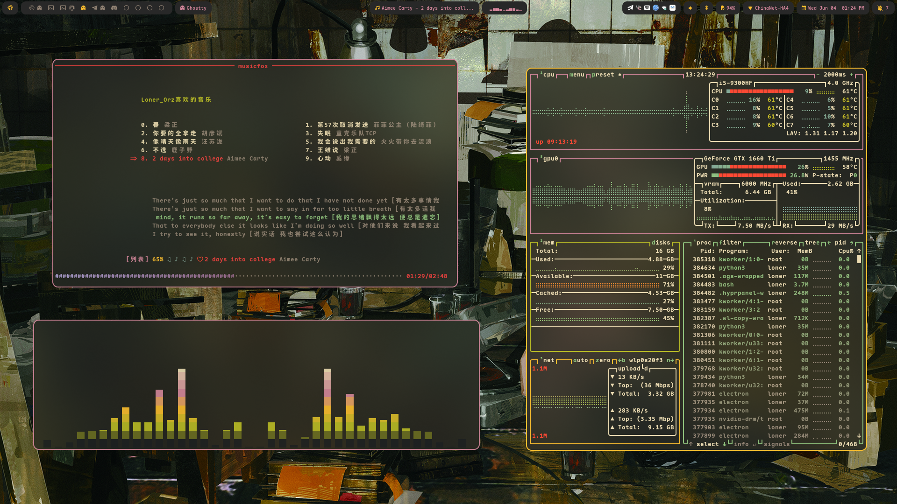
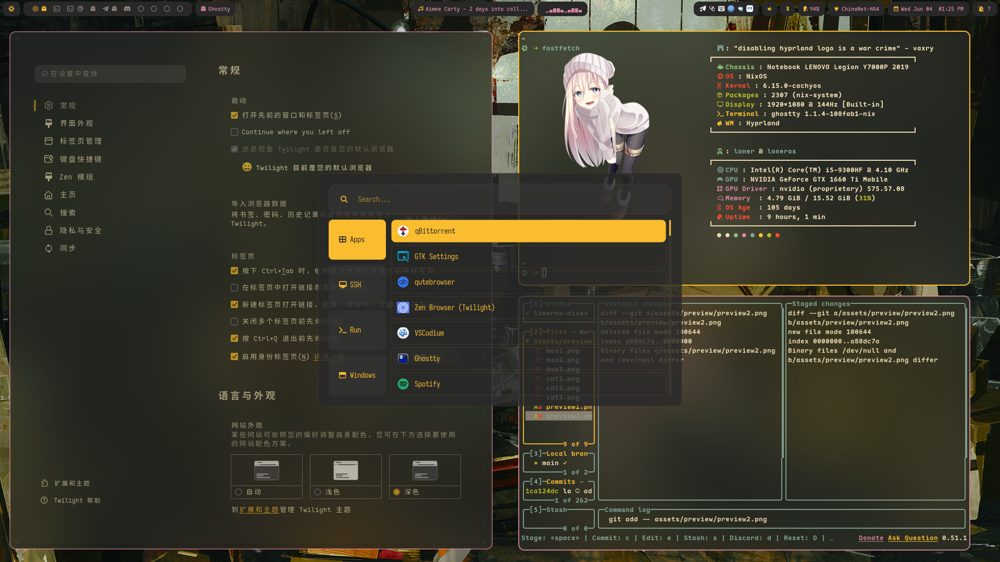
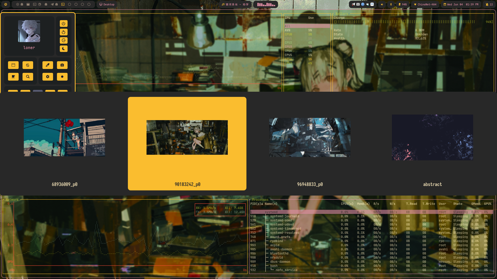

<h1 align="center">
   
   <br>
   Lonero's NixOS Configuration
   <br>
      <a href="https://github.com/catppuccin/catppuccin">
        
      </a>
   <br>
</h1>

<p align="center">
    My personal NixOS configuration, managed with Nix Flakes.
</p>

<div align="center">
    <a href="https://github.com/lonerOrz/loneros-nixos/stargazers">
        
    </a>
    <a href="https://github.com/lonerOrz/loneros-nixos/">
        
    </a>
    <a href="https://nixos.org">
        
    </a>
    <a href="https://github.com/lonerOrz/loneros-nixos/blob/main/LICENSE">
        
    </a>
</div>

> [!IMPORTANT]
> Note: I am not currently using home-manager for user-level dotfile configuration.

---

## 🖼️ Previews

### 🌟 Catppuccin Style

|  |  |  |
| :-----------------------------------: | :-----------------------------------: | :-----------------------------------: |

<details>
  <summary>🎨 Gruvbox Style (Click to expand)</summary>

|  |  |  |
| :-----------------------------------: | :-----------------------------------: | :-----------------------------------: |

</details>

---

## ✨ Features

- **Declarative & Reproducible**: Managed entirely by Nix Flakes for a consistent environment.
- **Window Managers**: Includes configurations for both [Hyprland](https://hyprland.org/) and [Niri](https://github.com/YaLTeR/niri).
- **Theming**: Themed with [Stylix](https://github.com/danth/stylix) and the beautiful [Catppuccin](https://github.com/catppuccin) color scheme.
- **Secrets Management**: Securely manages secrets using [sops-nix](https://github.com/Mic92/sops-nix).
- **Custom Packages**: Includes custom packages and overlays, defined in the `pkgs` and `overlays` directories.
- **Deployment**: Utilizes [deploy-rs](https://github.com/serokell/deploy-rs) for remote deployment.

---

## 📂 Structure

This repository is organized as follows:

- `flake.nix`: The entry point for the entire configuration, defining all inputs and outputs.
- `hosts/`: Contains system-level configurations for specific machines.
- `home/`: Manages user-level application configurations and dotfiles.
- `system/`: Holds global, cross-host system modules.
- `programs/`: Declaratively manages configurations for various applications.
- `servers/`: Contains configurations for system background services.
- `modules/`: Reusable custom NixOS modules for different configurations.
- `overlays/`: Modifications or overrides for existing packages in `nixpkgs`.
- `pkgs/`: Contains custom-defined packages.
- `themes/`: Manages themes and visual styles for the system and applications.
- `devShell/`: Provides development environments for different programming languages.
- `iso/`: Configuration for building a bootable NixOS ISO image.
- `deploy/`: Contains configurations related to remote deployment.
- `lib/`: Contains custom Nix helper functions.
- `secrets/`: Manages encrypted files using `sops-nix`.

---

## 🛠️ Installation & Usage

### 1. Initial Installation

To install this configuration on a new machine, you can use the provided `install.sh` script or manually use `nixos-install`.

**Automated Script:**

```bash
git clone https://github.com/lonerOrz/loneros-nixos.git
cd loneros-nixos
chmod +x install.sh
./install.sh
```

**Manual Flake Installation:**
Replace `<hostname>` with one of the defined hosts (e.g., `loneros`).

```bash
sudo nixos-install --flake .#<hostname>
```

### 2. Updating the System

To apply changes after modifying the configuration, run the following command:

```bash
# Using a helper tool like nh
nh os switch --flake .#<hostname>

# Or using standard nixos-rebuild
sudo nixos-rebuild switch --flake .#<hostname>
```

---

## 📝 TODO

- [x] Support more themes.
- [ ] Fix the "RemoteDesktop portal not implemented" error in `rustdesk` under Hyprland.
- [ ] Write more detailed documentation.

---

## 🔗 Credits

This configuration was inspired by and utilizes resources from the following projects:

- [NixOS Manual](https://nixos.org/manual/): For NixOS options and documentation.
- [Catppuccin](https://github.com/catppuccin/nixos): For the color scheme.
- [ZaneyOS](https://gitlab.com/Zaney/zaneyos): As a reference for configuration patterns.

---

## ☁️ Cache & Build Status

**My personal Cachix Cache**

- substituter: `https://loneros.cachix.org`
- public-key: `loneros.cachix.org-1:dVCECfW25sOY3PBHGBUwmQYrhRRK2+p37fVtycnedDU=`

[](https://loneros.cachix.org)
